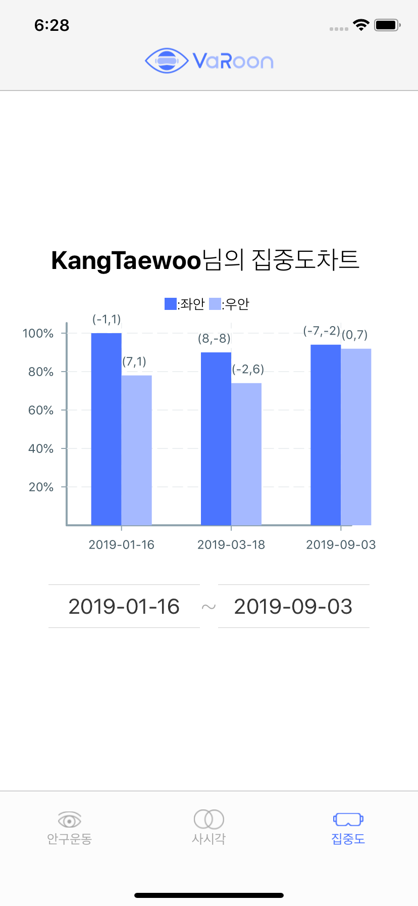

# VaRoon App

SW Maestro 10기 Tri_Catch 팀 **VaRoon** 프로젝트

목표: 사시 환자들을 위한 치료 경과도를 확인할 수 있는 어플리케이션 개발

## Getting Started

### execute application using expo

1. ```$ npm install expo-cli --global```

2. ```$ npm start```

3. Run on iOS or Android Simulator


## Architecture

_getData(): get data from API server

_renderStartDates(): show all dates 

_renderEndDates(): show 5 day after start date

_startValue(): execute when start date is changed

_endValue(): execute when end date is changed

## Running screen

### 로그인


### 안구운동차트


### 사시각차트


### 집중도차트

